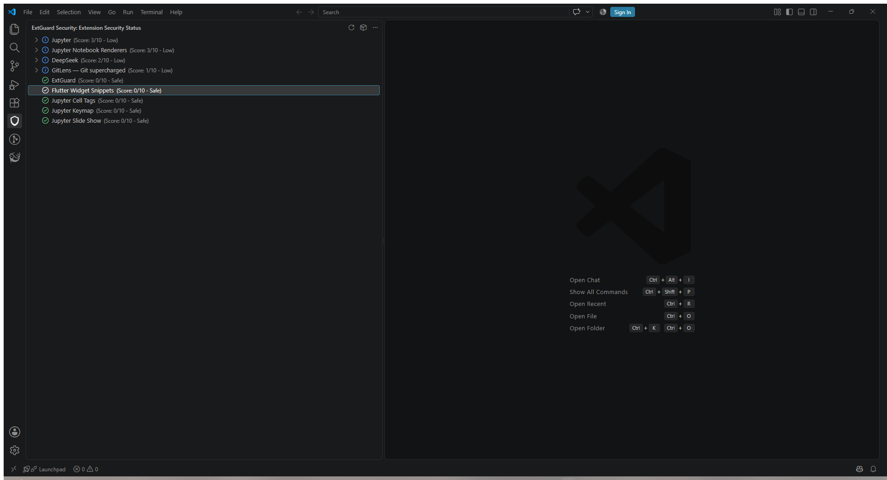
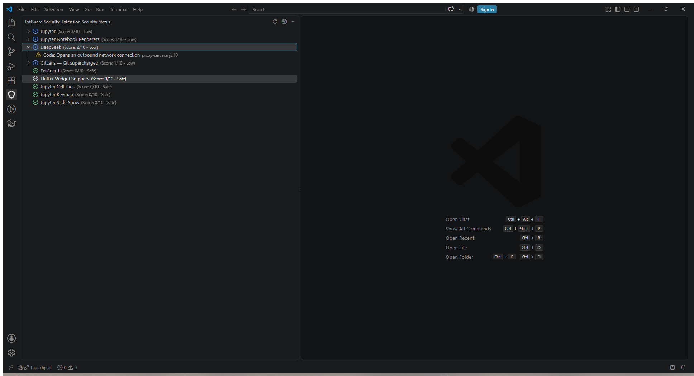
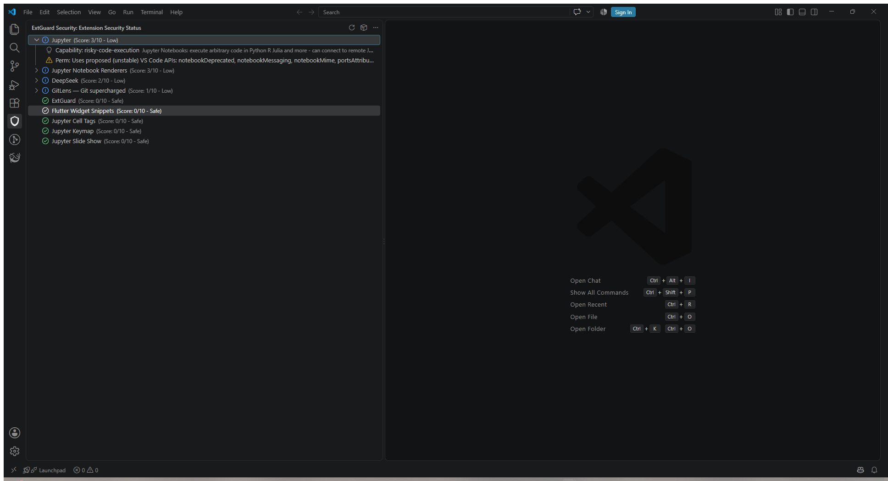

# ExtGuard

**Audit the VS Code extensions already installed on your machine. Entirely local.**

Install: `code --install-extension babstudios.extguard-security`

---

## Your extensions run with your full privileges

VS Code has no permission model. Any extension with a `main` entry point runs as ordinary
Node.js with the reach of your user account: your files, your environment variables, your
terminal, your network. There is nothing to over-request, because everything is already
granted.

The median developer has around 80 installed and has audited none of them.

ExtGuard reads what is already on disk and tells you which extensions earned their access.

## What it checks

**Known-malicious IDs.** Every installed extension is checked against 1,981 malicious
records and 1,300 blocked publishers, aggregated from public threat feeds including
Microsoft's own removed-packages list. The database ships inside the extension, so this check
never touches the network.

**Hardcoded secrets.** AWS keys, GitHub and GitLab tokens, Slack webhooks and OAuth tokens,
Stripe keys, Google API keys, npm tokens, private key blocks, and Azure DevOps PATs. A leaked
publisher PAT is the one that matters most: it lets an attacker ship an update to somebody
else's extension.

**Capability signals.** What each manifest reveals about reach, and what the shipped code
actually calls: process spawning, dynamic evaluation, outbound connections, and reads of
credential stores such as `~/.ssh` and `~/.aws`.

**A risk score per extension**, worst first, in a sidebar panel. Every finding cites the file
and line that caused it.

## See it in action

Installed extensions are sorted by risk, while clean extensions stay visibly green:



Findings identify the behavior and the exact shipped file and line:



High capability is explained separately from a security accusation:



## It is built to not cry wolf

This is the part most scanners get wrong, so it is worth being specific.

An early build of ExtGuard produced **2,850 findings across 57 of 82 extensions** on a clean
machine. That is not a security tool, it is a tool you learn to ignore. The current build
produces **zero critical or high findings on the same machine**.

Two decisions did most of that work.

**Behaviour is not a verdict.** Rules that look for process spawning or network calls run only
on readable source, never on minified bundles, JSON schemas or documentation. Matching the word
"request" inside a schema description is not a network call.

**Broad capability is not a threat.** Jupyter, the PowerShell extension, GitLens and AI coding
agents execute code and read your codebase because that is their entire purpose. ExtGuard
labels these as capability, with an explanation, and never as findings. A tool that opens by
calling Microsoft's own PowerShell extension a threat has told you nothing except that it
cannot be trusted.

## What it is not

Not antivirus, and not a sandbox. It cannot stop an extension that is already running. It
reports what is installed and what it can reach, so the decision is yours. A clean result means
these specific checks found nothing, not that every extension is safe.

## Privacy, which is the whole point

A tool that audits your editor for spyware cannot itself phone home.

- All scanning is local. Files are read in read-only mode and nothing is modified.
- No telemetry, no analytics, no account, and no network calls during a scan.
- The threat database is bundled, not fetched. The trade is complete privacy in exchange for
  data only as fresh as your last update, so ExtGuard shows you the snapshot date rather than
  implying its knowledge is current.
- If the database fails to load, ExtGuard says it could not check. It never reports a clean
  result it did not establish.
- One optional feature uses the network, off by default, and sends only extension IDs. See
  `extguard.checkMarketplace` below.

Full detail in [SECURITY.md](SECURITY.md).

## Compatibility

VS Code, Cursor, Windsurf, and any editor built on the VS Code API v1.75 or later.

## Getting started

1. Click the shield icon in the activity bar.
2. Press refresh, or run **ExtGuard: Scan Extensions** from the command palette.
3. Extensions are listed worst first. Expand any one to see its findings with file and line.
4. Trust a publisher permanently under Settings, ExtGuard, Allowed Publishers.

### Upgrading from the original 1.0.0 build

The permanent Marketplace identity is now `babstudios.extguard-security`. If
`babstudios.extguard` is still installed, remove that legacy copy after installing this one.
Version 1.0.2 detects it and links you directly to the old extension; the two builds use
separate command and view IDs so the current scanner keeps working during migration.

---

## Commands

| Command | What it does |
|---|---|
| **ExtGuard: Scan Extensions** | Audits everything installed and fills the sidebar. |
| **ExtGuard: Scan a .vsix File Before Installing** | Vets an extension package before you trust it. This is the only point at which you can act on a finding without having already run the code. |
| **ExtGuard: Remove Superseded Extension Versions** | Old versions stay on disk after an update. They are never loaded, but they are still readable code, so if a version is later found malicious that copy is still there. Reports the reclaimable space and removes only copies the editor has released. The newest version is always kept. |
| **ExtGuard: Show Threat Database Info** | How many records are bundled and when they were generated. The database ships with the extension, so its age matters and should not be guessed at. |

## Settings

| Setting | Default | Notes |
|---|---|---|
| `extguard.allowedPublishers` | `[]` | Publishers whose extensions bypass flagging. |
| `extguard.checkMarketplace` | `false` | Checks whether each installed extension is still published. An extension installed but absent from the Marketplace was usually removed by Microsoft, which is the strongest signal available and comes from the first party. **This is the only feature that uses the network.** Only extension IDs are sent, never file contents, paths or findings. A failed lookup reports "could not check" and never reports removal, because being offline is not evidence against an extension. |

## Development

```bash
npm install
npm run compile
# Press F5 in VS Code to launch Extension Development Host
npm test        # Run unit tests
```

## License

MIT
